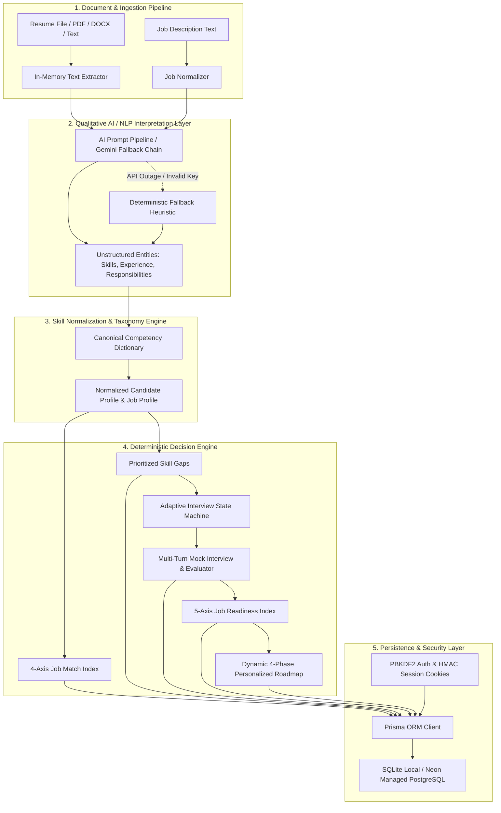

# HireMind AI — Technical Architecture Specification

**HireMind AI** is an open-source recruitment intelligence and interview-readiness platform designed around a **Hybrid Decision Architecture**: Qualitative AI/NLP Interpretation + Transparent Deterministic Scoring + Persistent Database State.

---

## 🏛 System Architecture Overview

---

## 🔬 Core Subsystems

### 1. Document Extraction & Ingestion Pipeline
- **Modules:** `src/app/api/extract-text/route.ts`, `pdf-parse`, `mammoth`.
- **Behavior:** Ingests raw `.pdf`, `.docx`, `.doc`, and `.txt` files up to 10MB. Files are decoded in Node.js buffer memory and converted to clean UTF-8 text strings without non-printable control characters. Raw binaries are never written to disk.

### 2. Qualitative AI & Resilience Layer
- **Modules:** `src/lib/ai.ts`.
- **Model Fallback Sequence:** `gemini-2.5-flash` → `gemini-1.5-flash` → `gemini-1.5-pro` → `gemini-2.0-flash`.
- **Status Reporting:** Every analysis returns explicit metadata: `source: "live-ai" | "deterministic-fallback"`.
- **Fail-Safe Operation:** If the external AI API is unreachable or returns malformed JSON, the built-in deterministic heuristic engine parses technical keywords, role hierarchies, and experience timelines automatically.

### 3. Deterministic Decision Engine
- **Modules:** `src/lib/engine.ts`.
- **4-Axis Match Formula:**
  $$\text{Match Index} = 0.35 \times \text{Required} + 0.35 \times \text{Evidence} + 0.20 \times \text{Semantic} + 0.10 \times \text{Breadth}$$
- **4-Dimension Interview Evaluation Formula:**
  $$\text{Turn Score} = 0.40 \times \text{Technical} + 0.25 \times \text{Depth} + 0.20 \times \text{Relevance} + 0.15 \times \text{Communication}$$
- **5-Axis Readiness Index Formula:**
  $$\text{Readiness Index} = 0.30 \times \text{Alignment} + 0.25 \times \text{Coverage} + 0.20 \times \text{Interview} + 0.15 \times \text{Technical} + 0.10 \times \text{Communication}$$

### 4. Adaptive Interview State Machine
- **Turn 1:** Probes candidate's highest-priority missing competency from the gap analysis.
- **Turn 2+:** Evaluates candidate response across accuracy, depth, and relevance. If depth is deficient or a sub-concept gap is detected (e.g. distributed locking or caching), the state machine branches to address that weakness.

### 5. Server-Side Security & Multi-Tenancy
- **Modules:** `src/lib/auth.ts`, `src/lib/session.ts`, `src/lib/rate-limit.ts`.
- **Authentication:** PBKDF2-HMAC-SHA512 password hashing (100,000 rounds) + signed HMAC-SHA256 session tokens in `HttpOnly` cookies.
- **Authorization:** Sessions linked to authenticated users reject unauthorized access with **403 Forbidden** at the database query level.
