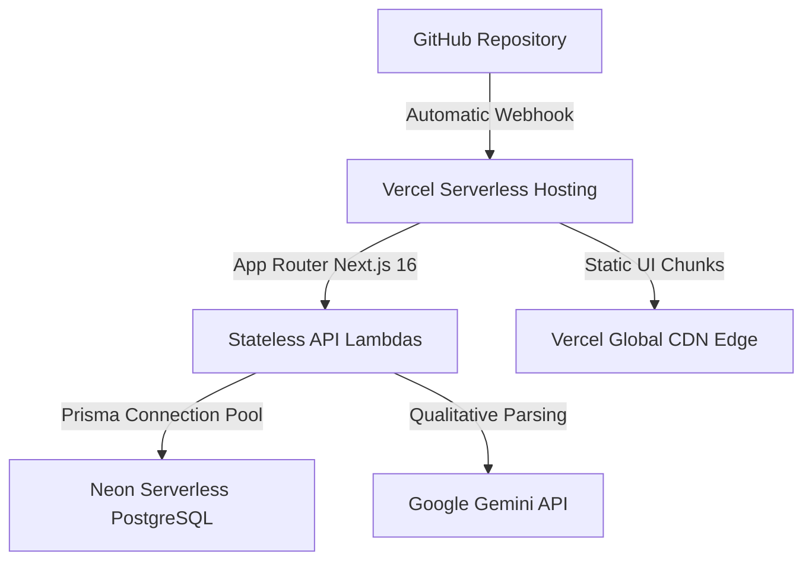

# Production Deployment Guide (Vercel + Neon Free Tier)

This guide walks you through deploying **HireMind AI** publicly using free-tier-compatible cloud infrastructure:
**GitHub → Vercel (Hobby Tier) → Neon (Serverless PostgreSQL) → Google Gemini (Optional)**

---

## 🏗 Architecture Overview



---

## 🚀 Step-by-Step Deployment

### 1. Provision Free PostgreSQL on Neon
1. Sign up at [neon.tech](https://neon.tech) (free tier includes 0.5 GiB storage and serverless auto-suspend).
2. Create a new project: `hiremind-production`.
3. Copy the pooled PostgreSQL connection string from the dashboard:
   ```text
   postgresql://[user]:[password]@[endpoint].neon.tech/neondb?sslmode=require
   ```

### 2. Push Code to GitHub
1. Create a new private or public repository on GitHub.
2. Initialize and push your repository:
   ```bash
   git remote add origin https://github.com/dikshant363/hiremind-ai.git
   git branch -M main
   git push -u origin main
   ```

### 3. Deploy to Vercel
1. Sign in to [vercel.com](https://vercel.com) and click **"Add New... → Project"**.
2. Select your `hiremind-ai` GitHub repository.
3. Configure the Build & Development Settings:
   - **Framework Preset:** `Next.js`
   - **Build Command:** `npx prisma generate && npx prisma db push --accept-data-loss && next build`
   - **Output Directory:** `.next`
4. Add the **Environment Variables**:
   - `DATABASE_URL`: `[Your Neon PostgreSQL Connection String]`
   - `AUTH_SECRET`: `[Generate a 64-char random hex string via openssl rand -hex 32]`
   - `AI_PROVIDER`: `gemini`
   - `GEMINI_API_KEY`: `[Your Google AI Studio Key, or leave blank for deterministic fallback]`
   - `NODE_ENV`: `production`
5. Click **"Deploy"**.

---

## 🩺 Post-Deployment Verification

### 1. Health Endpoint Diagnostic
Visit `https://YOUR-APP.vercel.app/api/health` to verify system health:
```json
{
  "status": "healthy",
  "checks": {
    "database": { "status": "healthy", "message": "PostgreSQL connected" },
    "aiProvider": { "status": "healthy" },
    "textExtractor": { "status": "healthy" }
  }
}
```

### 2. Live Smoke Test
1. Navigate to your deployed Vercel domain.
2. Upload an unseeded resume and submit a target job description.
3. Verify that candidate profile extraction, match indexing, and skill gaps render properly.
4. Execute an interview turn, submit an answer, and view the generated readiness index.
5. Refresh the page to confirm that the session successfully hydrates from Neon PostgreSQL.

---

## 🔄 Rollback & Maintenance

- **Instant Rollback:** Vercel provides atomic rollbacks to any previous successful deployment with one click from the Deployments tab.
- **Database Backup:** Neon automatically provides point-in-time recovery (PITR) within the free-tier retention window.
