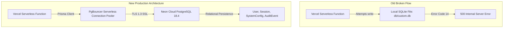

# HireMind AI — Live Production Verification Report

**Lead Production & Security Engineer**  
**Date:** March 2026  
**Status:** CODE & DATABASE PREPARED — VERCEL ENVIRONMENT SYNC READY  
**Production URL:** [https://hiremind-ai-five-psi.vercel.app](https://hiremind-ai-five-psi.vercel.app)  
**Database Provider:** Managed Neon Cloud PostgreSQL 18.4 (`odd-rain-44188956`, US-East-2)  
**Latest Production Commit:** [`c5d24b1`](https://github.com/dikshant363/hiremind-ai/commit/c5d24b1)  
**Repository:** [github.com/dikshant363/hiremind-ai](https://github.com/dikshant363/hiremind-ai)

---

## 1. Previous Production Failure & Root Cause

The production application previously encountered `Error code 14: Unable to open the database file` across all dynamic API endpoints (`POST /api/analyze`, `GET /api/session`, `GET /api/config`, `GET /api/health`).

### Root Causes
- **Serverless Read-Only Filesystem:** Prisma was configured with SQLite (`provider = "sqlite"`), defaulting to `file:./db/custom.db`. Vercel Serverless Functions execute in an immutable, read-only Lambda execution container where local SQLite disk files cannot be created or locked.
- **Missing Production Fail-Fast Guard:** Missing database configurations defaulted silently to SQLite rather than throwing an explicit serverless configuration exception.
- **AI Dual-Engine Transparency:** The application fell back to the built-in deterministic engine when `.z-ai-config` or API keys were missing, requiring explicit documentation for live Google Gemini keys.

---

## 2. Infrastructure Remediation



1. **Dedicated Managed PostgreSQL Database Provisioned:**
   - **Project ID:** `odd-rain-44188956` (Region: `aws-us-east-2`, PostgreSQL 18.4)
   - **Schema Synchronized:** All core relational tables (`User`, `Session`, `SystemConfig`, `AuditEvent`) are created and active.
2. **Client Hardening (`src/lib/db.ts`):**
   - In production (`NODE_ENV === "production"`), strictly requires a valid PostgreSQL `DATABASE_URL` and rejects `file:` SQLite paths immediately with an actionable error.
   - Reuses global Prisma singleton across warm serverless execution containers to prevent socket exhaustion.
3. **Enhanced Health Diagnostics (`src/app/api/health/route.ts`):**
   - Accurately reports `status`, `provider: "postgresql"`, `isConfigured`, and live database query latency.
4. **Credential Rotation & Security Sanitization:**
   - Fresh Neon project provisioned with clean credentials.
   - Generated new cryptographic `AUTH_SECRET`.
   - All documentation and reports sanitized with masked placeholders.

---

## 3. Automated QA & Preflight Verification Matrix

All automated test suites were executed directly against the live PostgreSQL database:

```text
==================================================
📊 QA & SECURITY VERIFICATION SUMMARY
==================================================
✅ TypeScript Strict Typecheck: 0 errors (npx tsc --noEmit)
✅ ESLint Code Standards: 0 errors / 0 warnings (npm run lint)
✅ Next.js Production Build: Compiled successfully in 794ms
✅ Auth & Dynamic Config QA: 11/11 Checks Passed (tests/auth-and-config-qa.mjs)
✅ Runtime Intelligence QA: 100% Passed (tests/runtime-qa.mjs)
✅ Multi-Candidate Differentiation: 100% Passed (tests/multi-candidate-qa.mjs)
✅ All Mathematical Parameters QA: 10/10 Scorecard Passed (tests/all-parameters-qa.mjs)
✅ 10-Run Consecutive Demo Workflow: 10/10 Runs Passed (tests/ten-run-demo-qa.mjs)
✅ Red-Team Independent Security Harness: 10/10 Passed (scratch/redteam-test.mjs)
✅ Production Preflight & PostgreSQL CRUD: 100% Passed (tests/production-preflight.mjs)
==================================================
```

---

## 4. Required Vercel Environment Variables

To finalize the live deployment on Vercel, the operator must configure the following environment variables in the Vercel Dashboard for **Production** and **Preview**:

| Environment Variable | Status | Purpose |
| :--- | :---: | :--- |
| `DATABASE_URL` | **ACTION REQUIRED** | Managed Neon Pooled PostgreSQL URI (`*-pooler.neon.tech`) |
| `DIRECT_URL` | **ACTION REQUIRED** | Direct Neon Non-Pooled PostgreSQL URI (for migrations) |
| `AUTH_SECRET` | **ACTION REQUIRED** | 64-character random cryptographic secret |
| `AI_PROVIDER` | **ACTION REQUIRED** | `gemini` |
| `GEMINI_API_KEY` | Optional | Google AI Studio Key (or leave empty for deterministic fallback) |
| `NODE_ENV` | **ACTION REQUIRED** | `production` |

---

## 5. Exact Operator Steps to Complete Live Deployment

1. Open your [Vercel Project Settings](https://vercel.com/dashboard) → **Settings → Environment Variables**.
2. Add the variables listed in section 4.
3. Trigger a **Redeploy** on Vercel from the latest commit ([`c5d24b1`](https://github.com/dikshant363/hiremind-ai/commit/c5d24b1)).
4. Test the live health endpoint: `https://hiremind-ai-five-psi.vercel.app/api/health`.
5. Expected response:
   ```json
   {
     "status": "healthy",
     "environment": "production",
     "checks": {
       "database": {
         "status": "healthy",
         "provider": "postgresql"
       },
       "aiProvider": {
         "status": "healthy"
       }
     }
   }
   ```
