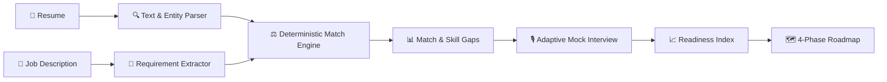

# HireMind AI

> **Evidence-Based Recruitment Intelligence & Adaptive Interview-Readiness Platform**  
> *Transforming resumes and job descriptions into transparent match scores, dynamic mock interviews, and actionable career roadmaps.*

[](https://github.com/dikshant363/hiremind-ai/actions/workflows/ci.yml)
[](LICENSE)
[](https://nextjs.org/)
[](https://www.typescriptlang.org/)
[](https://www.prisma.io/)
[](https://tailwindcss.com/)

---

## 🌟 Overview

**HireMind AI** addresses Problem Statement **PS 02: Automated Smart Resume Parser & Mock Interviewer**. 

Unlike black-box screening systems that rely solely on unpredictable LLM prompts, HireMind AI utilizes a **Hybrid Decision Architecture**:
1. **AI / NLP** interprets unstructured resume documents and job postings.
2. **Deterministic Algorithms** calculate transparent, reproducible match scores and readiness indices.
3. **Adaptive State Machines** conduct dynamic mock interviews that branch based on candidate answers.
4. **Actionable Roadmaps** guide candidates step-by-step from skill gaps to interview mastery.



---

## ✨ Key Capabilities

- **📄 Universal Document Ingestion:** Parses `.pdf`, `.docx`, and `.txt` files up to 10MB in-memory.
- **⚖️ 4-Axis Job Match Index:** Evaluates alignment across Required Skills (35%), Work Evidence (35%), Semantic Relevance (20%), and Breadth (10%).
- **🎙️ Adaptive Mock Interviewer:** Dynamic multi-turn interview simulator that probes specific weaknesses uncovered during answer evaluations.
- **📈 5-Axis Job Readiness Index:** Mathematical score aggregating Alignment, Gap Coverage, Interview Performance, Technical Depth, and Communication Clarity.
- **🗺️ Personalized 4-Phase Roadmap:** Step-by-step learning progression (Foundations → Core Skills → Practical Applications → Interview Readiness).
- **🔒 Cryptographic Security & Privacy:** PBKDF2 password hashing (100k rounds), signed HMAC-SHA256 session tokens, server-side session isolation (403 Forbidden), and direct data deletion.
- **🛡️ 100% Offline Resilience:** Operates with full fidelity using a built-in deterministic heuristic engine when external AI APIs are unconfigured or unavailable.

---

## 🚀 Quickstart (5 Minutes)

### 1. Prerequisites
- **Node.js:** v18.17.0+ (Node.js 20 LTS recommended)
- **npm:** v9.x or higher

### 2. Clone & Install
```bash
# Clone the repository
git clone https://github.com/dikshant363/hiremind-ai.git
cd hiremind-ai

# Install dependencies
npm install

# Copy environment configuration
cp .env.example .env

# Generate Prisma client and initialize database
npx prisma generate
npx prisma db push

# Start development server
npm run dev
```

Open [http://localhost:3000](http://localhost:3000) in your browser.

---

## ⚙️ Configuration & Environment

| Variable | Required | Description |
|---|---|---|
| `DATABASE_URL` | **Yes** | SQLite path (`file:../db/custom.db`) or PostgreSQL URI |
| `AUTH_SECRET` | **Yes** | 64-character secret for HMAC session tokens |
| `AI_PROVIDER` | Optional | `gemini` (default) or `deterministic-fallback` |
| `GEMINI_API_KEY` | Optional | Google AI Studio API key for live LLM extraction |

See [ENVIRONMENT.md](ENVIRONMENT.md) for full configuration details.

---

## ☁️ Free-Tier Cloud Deployment

HireMind AI is designed to deploy on currently available free-tier cloud infrastructure:
**GitHub → Vercel Hobby → Neon Serverless PostgreSQL → Google Gemini (Optional)**

See [DEPLOYMENT.md](DEPLOYMENT.md) for step-by-step setup instructions.

---

## 🧪 Testing & Verification

Run the verified test suites:
```bash
# Static typecheck
npx tsc --noEmit

# Code standards
npm run lint

# Automated QA suites
node tests/auth-and-config-qa.mjs
node tests/runtime-qa.mjs
node tests/multi-candidate-qa.mjs
node tests/all-parameters-qa.mjs
node tests/ten-run-demo-qa.mjs

# Red-team security verification
node scratch/redteam-test.mjs
```

See [TESTING.md](TESTING.md) for full test specifications.

---

## 🗺 Roadmap & Milestones

- **Phase 0:** Hackathon Foundation (`COMPLETED`)
- **Phase 1:** Core Intelligence Engine (`COMPLETED`)
- **Phase 2:** Production Hardening & Performance (`COMPLETED`)
- **Phase 3:** Public Open-Source Release (`CURRENT`)
- **Phase 4:** Managed PostgreSQL Cloud Staging (`IN PROGRESS`)
- **Phase 5:** Public Beta & Community Feedback (`PLANNED`)

See [ROADMAP.md](ROADMAP.md) for milestone details.

---

## 🤝 Contributing

We welcome community contributions! Please read our [Contributing Guide](CONTRIBUTING.md) and [Code of Conduct](CODE_OF_CONDUCT.md) before opening a pull request.

---

## 📜 License

This project is licensed under the [MIT License](LICENSE).
