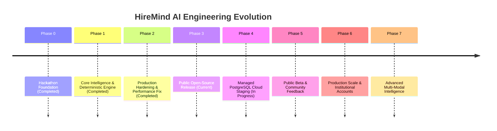

# HireMind AI — Product & Engineering Roadmap

This document outlines the multi-phase engineering roadmap and milestone delivery schedule for HireMind AI.

---

## 🗺 Product Maturity Phases

---

### Phase 0 — Hackathon Foundation
- **Status:** `COMPLETED`
- Initial project prototype and UI mockup for Problem Statement PS 02 (*Automated Smart Resume Parser & Mock Interviewer*).
- Client-side navigation shell with mock candidate flow.

### Phase 1 — Core Intelligence Engine
- **Status:** `COMPLETED`
- Authoritative deterministic scoring engine (`src/lib/engine.ts`).
- 4-axis match index formula (`0.35 * required + 0.35 * evidence + 0.20 * semantic + 0.10 * breadth`).
- 4-dimension interview answer evaluation (`0.40 * tech + 0.25 * depth + 0.20 * relevance + 0.15 * comm`).
- 5-axis readiness index calculation (`0.30 * align + 0.25 * cov + 0.20 * int + 0.15 * tech + 0.10 * comm`).
- Dynamic 4-phase roadmap generation.
- Real PDF/DOCX document text extraction pipeline.

### Phase 2 — Production Hardening & Performance
- **Status:** `COMPLETED`
- Multi-model Gemini fallback integration (`gemini-2.5-flash`, `gemini-1.5-flash`, `gemini-1.5-pro`, `gemini-2.0-flash`).
- Safe API key validation and transparent status reporting (`live-ai` vs `deterministic-fallback`).
- Static GPU-friendly radial background gradients (eliminated CPU/GPU redraws).
- React compound key collision fixes and session persistence across page refreshes.
- PBKDF2 cryptographic password hashing and signed HMAC session cookies.
- Server-side session isolation (403 Forbidden enforcement on cross-user queries).
- Sliding-window in-memory rate limiting for compute endpoints.
- Independent Red-Team Verification suite: 100% test pass rate across 5 automated QA suites.

### Phase 3 — Public Open-Source Release (CURRENT)
- **Status:** `IN PROGRESS`
- Standardized GitHub community health templates (Bug Report, Feature Request, Performance, Security).
- PR templates, Contributor Covenant Code of Conduct, and Contributing guides.
- Full Architecture Decision Records (`docs/decisions/ADR-001` to `ADR-006`).
- GitHub Actions CI workflow (typecheck, lint, test, build).
- Explicit data deletion API (`DELETE /api/session?id=...`).
- Open Source License documentation.

### Phase 4 — Managed PostgreSQL Cloud Staging
- **Status:** `IN PROGRESS`
- Neon serverless PostgreSQL connectivity and Prisma migration deployment.
- Vercel Hobby free-tier deployment configuration and environment isolation.
- Cloud smoke test harness with real resume ingestion.

### Phase 5 — Public Beta & Community Feedback
- **Status:** `PLANNED`
- User feedback collection on interview realism and roadmap actionability.
- Expanded technical skill taxonomy (>500 normalized competencies).
- Automated CI end-to-end browser integration tests with Playwright.

### Phase 6 — Production Scale & Recruiter Workspaces
- **Status:** `PLANNED`
- Multi-candidate side-by-side candidate comparison matrix.
- Team workspaces and institutional dashboards for universities/bootcamps.
- Role benchmark libraries and custom evaluation rubric builders.

### Phase 7 — Advanced Multi-Modal Intelligence
- **Status:** `FUTURE`
- Live voice-dictation and speech fluency analysis during mock interviews.
- Longitudinal candidate skill progress tracking across multiple interview sessions.
- Interactive code snippet execution and technical diagram whiteboard evaluations.

---

## 🎯 Engineering Milestones

| Milestone | Target | Description | Status |
|---|---|---|---|
| **M0** | Week 1 | Hackathon MVP Shell | `COMPLETED` |
| **M1** | Week 2 | Deterministic Engine & Ingestion | `COMPLETED` |
| **M2** | Week 3 | Hardening, Auth & Rate Limiting | `COMPLETED` |
| **M3** | Week 4 | Open Source Repository & Community Health | `CURRENT` |
| **M4** | Week 5 | Vercel + Neon Free Cloud Deployment | `PLANNED` |
| **M5** | Month 2 | Public Beta Release | `PLANNED` |
| **M6** | Month 3 | Community Growth & Expanded Taxonomy | `PLANNED` |
| **M7** | Month 4 | Enterprise & Recruiter Workspace | `FUTURE` |
