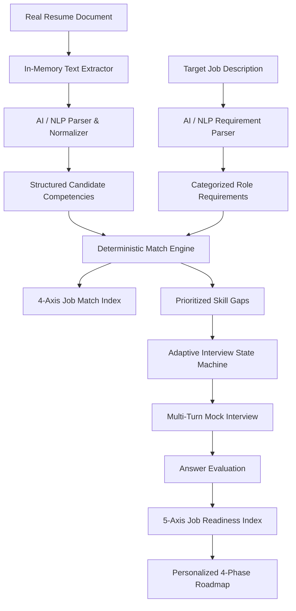

# HireMind AI — Hackathon Submission Brief

**Problem Statement:** PS 02 — Automated Smart Resume Parser & Mock Interviewer  
**Repository:** [HireMind AI](https://github.com/dikshant363/hiremind-ai)  
**Architecture Paradigm:** Hybrid Qualitative AI Interpretation + Transparent Deterministic Scoring Engine

---

## 🎯 The Core Problem

Traditional candidate preparation and recruitment screening suffer from two distinct failure modes:
1. **Keyword-matching Applicant Tracking Systems (ATS):** Naively search for verbatim string matches without understanding underlying engineering competencies or domain depth.
2. **Pure LLM Assessment Tools:** Suffer from the "black-box problem"—scores fluctuate unpredictably, lack mathematical grounding, and cannot be defended to candidates or recruiters.

---

## 💡 The HireMind AI Solution

HireMind AI introduces a **Dual-Engine Architecture** that bridges AI qualitative fluency with deterministic mathematical rigor:

---

## 🔬 Core Technical Innovations

### 1. Transparent 4-Axis Match Algorithm
Unlike black-box LLM ratings, HireMind AI calculates candidate alignment using an open, verifiable formula:
$$\text{Match Index} = 0.35 \times \text{Required} + 0.35 \times \text{Evidence} + 0.20 \times \text{Semantic} + 0.10 \times \text{Breadth}$$
Each component is traceable to specific matched skills, years of verified experience, and competency levels.

### 2. Adaptive Interview Branching
Interviews are not static questionnaires. If a candidate submits a weak answer regarding high-throughput architecture, the system detects the knowledge gap and dynamically pivots subsequent questions to evaluate that uncovered weakness.

### 3. Transparent AI & Deterministic Fallback Mode
HireMind AI is built for 100% production uptime. If an external LLM provider experiences outages or rate limits, the platform automatically switches to its local deterministic intelligence engine. The UI truthfully informs the user of the active processing source (`live-ai` vs `deterministic-fallback`).

---

## 🎬 3-Minute Demo Walkthrough

1. **Candidate Profile & Ingestion:** Upload an unseeded resume (PDF/DOCX/Text). Watch real-time parsing extract structured skills, work history, and education.
2. **Job Requirement & Gap Analysis:** Input a target job description. The 4-axis Match Index computes immediately, highlighting critical vs nice-to-have skill gaps.
3. **Adaptive Mock Interview:** Enter the interview simulator. Answer Question 1. View the 4-dimension evaluation breakdown (Technical Accuracy, Depth, Relevance, Communication) and observe how Question 2 adapts to your answer.
4. **Readiness Report & Roadmap:** View your aggregate Job Readiness Index (0–100) and actionable 4-phase improvement plan (Foundations → Core Skills → Practical Applications → Interview Readiness).
5. **Session Hydration & Deletion:** Refresh the browser to verify complete session persistence, or trigger one-click permanent data deletion.
