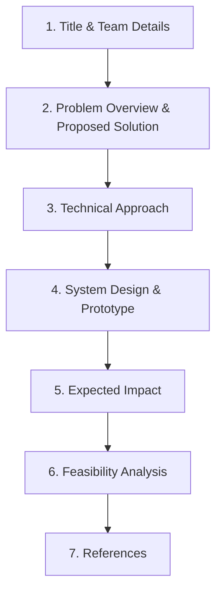
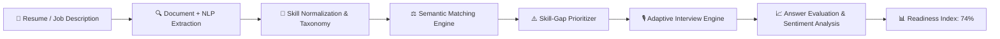
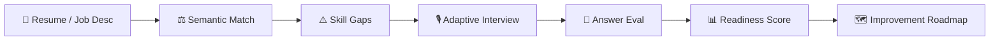

# TECHNOISM — Project Presentation

> **SSIP / Technoism Hackathon Project Presentation**  
> **Team ID:** CKPHACK065  
> **Team Name:** CODE NEXUS  
> **Project Title:** HireMind AI  
> **Problem Statement Title:** Automated Smart Resume Parser & Mock Interviewer (PS 02)  

---

## 📑 Slide Deck Overview

---

## Slide 1: Cover & Team Identification

- **Event:** TECHNOISM / SSIP Project Presentation
- **Team ID:** `CKPHACK065`
- **Project Title:** **HireMind AI**
- **Team Name:** **CODE NEXUS**
- **Problem Statement Title:** *Automated Smart Resume Parser & Mock Interviewer*

---

## Slide 2: Problem Overview & Proposed Solution

### Problem Overview
- **⚠️ Recruiter Time Drain:** Excessive hours spent on manual screening and fit assessment.
- **🔍 Skill Blindspots:** Students and job seekers lack clarity on critical competencies missing for target roles.
- **⏳ Flawed Keyword Matching:** Traditional ATS screening relies on shallow string matching, missing qualified candidates.
- **♾️ Static, Non-Adaptive Vetting:** Generic mock interviews fail to target individual technical weaknesses.

### Proposed Solution
- **🤖 AI-Powered NLP Extraction:** Automatically parses and structures candidate skills into evidence-based competency maps.
- **🧩 Semantic Skill Normalization:** Intelligent matching connects candidate skills with job requirements beyond verbatim wording.
- **⚡ Dynamic Skill Gaps:** Instantly identifies and prioritizes missing competencies for target roles.
- **🎙️ Adaptive Interview Engine:** Conducts tailored, real-time evaluations driven by detected knowledge gaps.
- **📊 Job Readiness Metrics:** Generates explainable job-fit scores and personalized actionable roadmaps.

### Pipeline Comparison

| Pipeline | Resume Ingestion | Screening / Evaluation | Mock Interview | Outcome / Clarity |
|:---|:---|:---|:---|:---|
| **Current Industry** | Resume 📄 | Manual Screening ⏳ | Generic Static Questions 📄 | Unclear Readiness ❓ |
| **HireMind AI (Code Nexus)** | Resume 📄 | Semantic Skill Gaps 🎯 | **Adaptive AI Interview** 🎙️ | **Readiness + Action Plan** 🗺️ |

> *"The interview adapts to the candidate's weaknesses — and every answer becomes new evidence."*

---

## Slide 3: Technical Approach

### Technology Stack
- **Frontend:** Next.js 16 (App Router) • TypeScript • Tailwind CSS 4 • Radix UI • Lucide Icons
- **Backend:** Node.js / Next.js Route Handlers • API-driven modular architecture • REST APIs
- **AI / NLP:** Large Language Models (LLM) • Natural Language Processing (NLP) • Text Embeddings • Semantic Similarity
- **Intelligence Engine:** Skill Taxonomy • Semantic Normalization • 4-Axis Weighted Matching • Deterministic Scoring
- **Data Persistence:** SQLite (local development) • PostgreSQL / Neon (cloud serverless) • Prisma ORM

### Foundational Paradigm
> **"AI for understanding + generation | Deterministic logic for scoring + decisions"**

---

## Slide 4: System Design & Prototype

### Prototype Architecture Breakdown

1. **Job Match Engine (82% Sample):**
   - *Matched Skills:* Python, SQL, Machine Learning, FastAPI
   - Evaluated across Required Alignment (35%), Evidence Strength (35%), Semantic Relevance (20%), and Breadth (10%).

2. **Critical Gaps Detected:**
   - System Design 🔴
   - Docker 🔴
   - AWS 🟡

3. **Adaptive AI Mock Interview:**
   - *Dynamic Pivot:* Next question is dynamically generated based on the candidate's detected weakness (e.g. Real-time question generation on System Design, Docker, AWS).

4. **Interview Evaluation & Job Readiness:**
   - **Evaluation Dimensions:** Accuracy: 72% • Relevance: 84% • Depth: 61%
   - **Job Readiness Index:** **74%**
   - **Personalized Actionable Roadmap:**
     1. Practice microservices and high-throughput architectural patterns.
     2. Run container orchestration mock scenarios (Docker / Kubernetes).
     3. Deploy sample production microservices on AWS ECS/EKS.

---

## Slide 5: Expected Impact

### Target Users & Outcomes
- **🎓 Students & Job Seekers:** Identify and systematically close job-specific skill gaps before real interviews.
- **👔 Recruiters:** Faster candidate screening with explainable, evidence-backed competency assessments.
- **🏫 Colleges & Institutions:** Quantitatively measure and benchmark graduate employability readiness.

### Key Benefits & Impact
- **🌍 Social Impact:**
  - Democratized, personalized interview preparation accessible to all students.
  - Evidence-driven competency development replacing guesswork.
  - Transparent, unbiased understanding of job readiness.
- **💼 Economic Benefits:**
  - Drastically reduced repetitive manual screening hours for hiring teams.
  - Higher signal-to-noise ratio in candidate-role matching.
  - Shorter time-to-hire and reduced onboarding churn.

> *"DON'T JUST TELL CANDIDATES IF THEY ARE READY. TELL THEM EXACTLY WHAT TO FIX NEXT."*

### Future Scope
- **Candidate → Recruiter → College → Workforce Intelligence Ecosystem**
- ATS Integrations (Greenhouse, Lever, Workday)
- Live Job Market Intelligence Feeds
- Full Voice-to-Voice AI Interviews
- Continuous Multi-Turn Competency Tracking

---

## Slide 6: Feasibility Analysis

### Technical Feasibility & Practical Implementation
- **Proven Technologies:** Uses state-of-the-art NLP, embeddings, and generative LLMs without requiring expensive foundation-model pre-training from scratch.
- **Modular Monolith Architecture:** Clean separation of concerns (parsers, engines, state machines, storage) allowing effortless scaling into independent microservices.
- **Deterministic Explainability:** Mathematical scoring formulas guarantee reproducible, auditable results.
- **Complete End-to-End Workflow:** Full candidate profile → job match → adaptive interview → readiness evaluation → roadmap workflow verified.

### Challenges, Risks & Mitigations

| Challenge / Risk | Potential Impact | Mitigation in HireMind AI |
|:---|:---|:---|
| **AI / API Latency & Outages** | System unavailability | Built-in **100% resilient deterministic offline engine** with automatic graceful fallback. |
| **Resume Format Variability** | Parsing failures on odd PDFs/DOCX | Multi-stage in-memory text extraction (`pdf-parse`, `mammoth`, plain-text fallback regex). |
| **LLM Evaluation Inconsistency** | Fluctuating, hallucinated scores | **Structured JSON output schemas** + deterministic mathematical scoring aggregators. |

---

## Slide 7: References & Literature

### Information Extraction & Embeddings
1. **Vaswani, A., et al. (2017).** *Attention Is All You Need.* [arXiv:1706.03762](https://arxiv.org/abs/1706.03762)
2. **Reimers, N., & Gurevych, I. (2019).** *Sentence-BERT: Sentence Embeddings using Siamese BERT-Networks.* [arXiv:1908.10084](https://arxiv.org/abs/1908.10084)
3. **Singh, A., et al. (2019).** *Information Extraction from Resumes using NLP Techniques.* [doi:10.1109/ICAC3.2019.8944390](https://doi.org/10.1109/ICAC3.2019.8944390)

### AI Evaluation & Matching Research
1. **Sun, S., et al. (2023).** *Large Language Models are State-of-the-Art Evaluators.* [arXiv:2303.16634](https://arxiv.org/abs/2303.16634)
2. **Zhang, J., et al. (2021).** *A Semantic-Based System for Resume and Job Matching.* [doi:10.1016/j.jbi.2021.103783](https://doi.org/10.1016/j.jbi.2021.103783)
3. **Duan, H., et al. (2021).** *AI-Driven Competency-Based Recruitment and Selection Systems.* [doi:10.1016/j.chb.2021.106899](https://doi.org/10.1016/j.chb.2021.106899)

### Official Documentation & Frameworks
1. **OpenAI / Google Gemini API Documentation:** Structured Outputs & Embeddings Developer Guides.
2. **FastAPI & Next.js Frameworks:** High-performance, production-ready web APIs and App Router architectures.
3. **SentenceTransformers:** Library for state-of-the-art sentence, text, and image embeddings ([sbert.net](https://sbert.net)).
4. **LangChain & AI SDKs:** Frameworks for LLM orchestration and structured generation.

---

## 👥 Team & Submission Information

- **Project:** HireMind AI
- **Team ID:** `CKPHACK065`
- **Team Name:** `CODE NEXUS`
- **Event:** TECHNOISM / SSIP Hackathon
- **Problem Statement:** PS 02 — Automated Smart Resume Parser & Mock Interviewer
